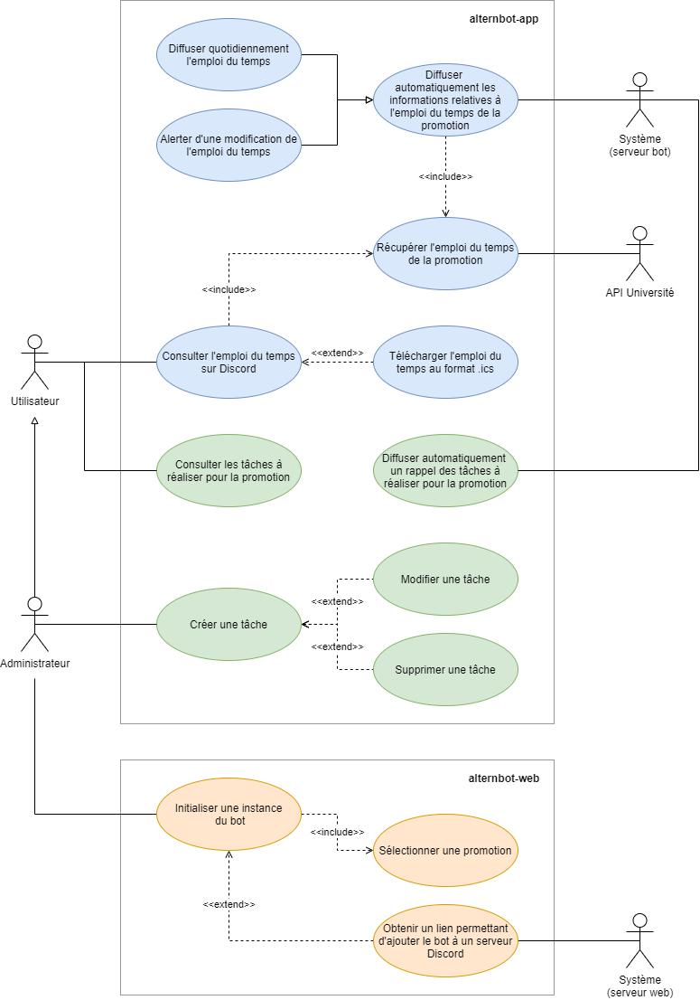
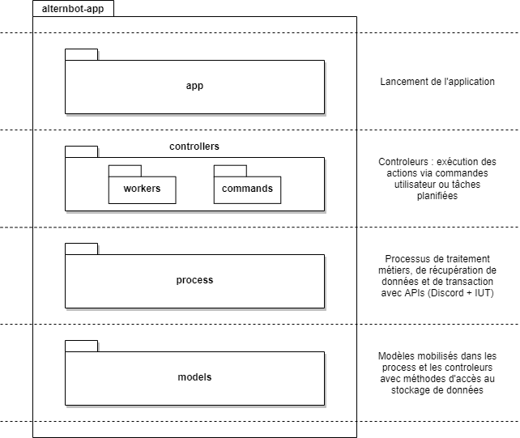
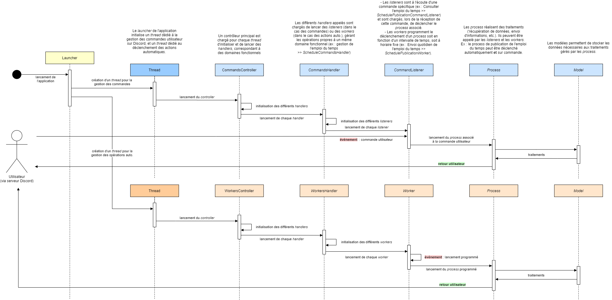
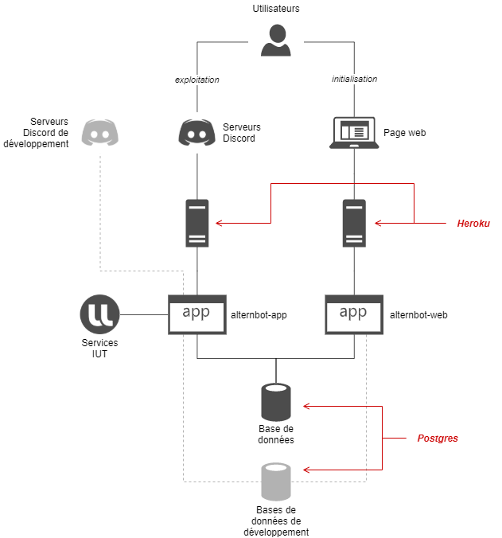

Altern'Bot :robot:
===========

[](https://github.com/B4va/alternbot-app/CI%20master)
[](https://storage.googleapis.com/alternbot-coverage/jacoco/index.html)

Bot *Discord* utile aux alternants de l'Université de Lorraine.

Doit permettre un accès facile et rapide à des outils de collaboration et aux informations qui concernent la promotion.

## Participants

- [Zachary Arnaise](https://github.com/zacharyarnaise) : Responsable CI/CD & tests
- [Alexis Beer](https://github.com/alexisbe-github) : Responsable développements & qualité
- [Kevin Junck](https://github.com/novachrono67) : Analyste fonctionnel
- [Arnaud Pythoud](https://github.com/Pythoud-dev) : Responsable infrastructures & exploitation
- [Loïc Steinmetz](https://github.com/loicsteinmetz) : Chef de projet, analyste technique

## Liens utiles

- [Documentation](https://www.notion.so/bava/Altern-Bot-d51836745d434908a81b12c573c17b0a) (Notion)
- [Gestion de projet](https://trello.com/b/V4lDMseD/alternbot-iutm) (Trello)
- [Repo interface web](https://github.com/loicsteinmetz/alternbot-web) (Github)

## Présentation générale

### Fonctionnalités

- **Gestion de l'emploi du temps :** récupération et diffusion de l'emploi du temps de la promotion
- **Gestion des travaux :** système d'enregistrement et de rappel des travaux à faire
- **Interface d'initialisation :** interface web permettant d'initialiser le bot sur un serveur Discord.



### Architecture technique

**Packages :**



**Séquence type :**



## Documentation

### Mise en place de l'environnement de développement

**1. Cloner le repository**
   

**2. Configurer une base de données**

Nécessite une base de données PostgresSQL :

- Installer un serveur PostgresSQL local ([https://www.postgresql.org/download/](https://www.postgresql.org/download/)) ou utiliser un service de management en ligne (exemple : [https://www.elephantsql.com/](https://www.elephantsql.com/)).
- Configurer l'accès de l'application à la base de données :
    - Créer un fichier `ENVIRONMENT.properties` dans le dossier `ressources/utils`.
    - Renseigner les paramètres `DB_URL`, `DB_USER` et `DB_PASSWORD` avec les identifiants de connexion.

**3. Lancer les opérations de migration et de seed**

*Migration :*

Exécuter le programme de migration via la classe `MigrationsLauncher` en ajoutant l'argument `-migrate`.

→ Le script `V1__creation_table_test.sql` doit normalement être exécuté, est une table `Tests` doit avoir été créée.

*Réinitialisation de la base :*

Exécuter le programme de migration via la classe `MigrationsLauncher` en ajoutant l'argument `-clean`.

→ La base de données doit normalement être réinitialisée.

*Seed :*

- Exécuter à nouveau l'opération de migration.
- Exécuter le programme de seed via la classe `SeedLauncher`.

→ Les tables de la base de données doivent contenir des données.

**4. Configurer un bot discord de développement**

- Accéder à l'espace Discord Developers : [https://discord.com/developers/](https://discord.com/developers/applications) (connexion nécessaire avec un compte Discord).
- Dans l'onglet "Applications", créer une nouvelle application.
- Ajouter un bot via l'onglet "Bot" de l'application créée.
- Dans le fichier `ENVIRONMENT.properties`, renseigner le paramètre `BOT_TOKEN` avec le token du bot créé.

**5. Ajouter le bot à un serveur Discord de test**

- Créer un serveur Discord de test.
- Récupérer le `CLIENT_ID` du bot via le portail développeur Discord → App.
- Générer un lien avec les permissions nécessaires (à défaut, toutes les permissions) via le site suivant : [https://discordapi.com/permissions.html](https://discordapi.com/permissions.html).
- Ajouter le bot au serveur de test via le lien généré.

**6. Compléter la configuration**

*Logs :*

Le niveau des logs peut être configuré en ajoutant un paramètre `LOG_LEVEL` au fichier `ENVIRONMENT.properties`. Les valeurs possible, dans l'ordre croissant d'affichage des détails sont :

- `FATAL`
- `ERROR`
- `WARN`
- `INFO`
- `DEBUG`
- `TRACE`

Le niveau des logs est configuré par défaut sur `INFO`.

*Prise en compte du serveur de test :*

Dans le fichier `ENVIRONMENT.properties`, renseigner les paramètres :

- `SERVER_TEST` : Identifiant du serveur de test, à récupérer dans `paramètres du serveur > widget > identifiant du serveur`.
- `SCHEDULE_URL` : Url de l'emploi du temps.
- `CHANNEL_TEST` : Channel dans lequel les informations seront publiées.

*Exemple de fichier de configuration :*

```
LOG_LEVEL=debug
DB_URL=jdbc:postgresql://localhost/alternbot
DB_USER=user
DB_PASSWORD=pwd
BOT_TOKEN=azertyuiopqsdfghjklmwxcvbn
SERVER_TEST=123456789
SCHEDULE_URL=https://dptinfo.iutmetz.univ-lorraine.fr/lna/agendas/ical.php?ical=azerty
CHANNEL_TEST=général
```

### CI/CD & Mise en production

Les développements sont réalisés via [pull requests](https://github.com/loicsteinmetz/alternbot-app/pulls).
Ils doivent être validés par au moins 1 autre développeur, dont le chef de projet, et ne doivent pas provoquer
d'erreur lors de l'exécution des tests automatiques.

Les différentes [versions](https://github.com/loicsteinmetz/alternbot-app/tags) sont déployées via Heroku.
Idem pour [l'interface web](https://github.com/loicsteinmetz/alternbot-web).

**Infrastructure**



### Ressources complémentaires

- [Hibernate](http://hibernate.org/orm/documentation/5.4/) : structuration et manipulation des modèles.

  *La doc native n'est pas géniale ; le mieux reste encore Google et une recherche concernant directement l'opération à réaliser...*

- [JUnit 5](https://junit.org/junit5/docs/current/user-guide/) : tests
- [JDA](https://github.com/DV8FromTheWorld/JDA) : opérations via API Discord
- [JDA utilities - command](https://github.com/JDA-Applications/JDA-Utilities/tree/master/command) : gestion spécifique des commandes Discord